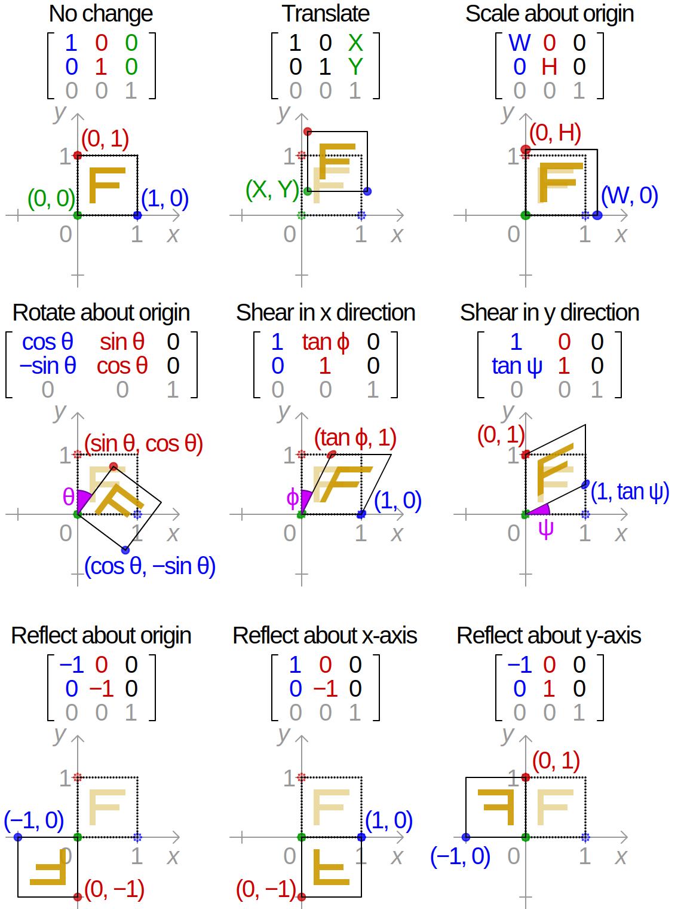
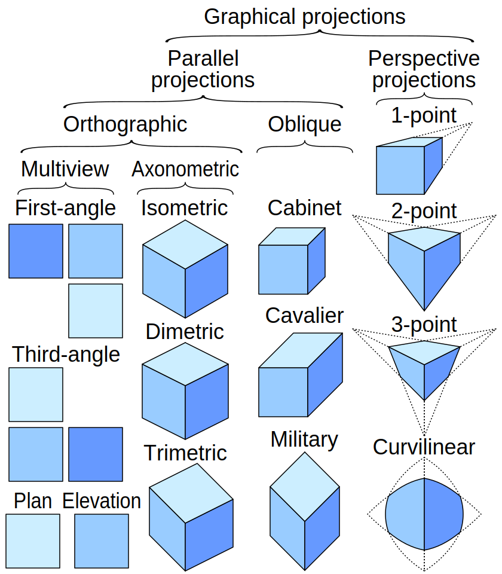

## Liniowe funkcje (dla wektorów)

### Własności
Funkcję f nazywamy liniową (mapą) gdy dla dowolnych dwóch elementów (wektorów )
i dowolnych skalarów spełnione są zależności:

$$
\newcommand{\bra}[1]{\left\langle#1\right|}
\newcommand{\ket}[1]{\left|#1\right\rangle}
\newcommand{\bracket}[2]{\left\langle#1 \vphantom{#2}\middle|  #2 \vphantom{#1}\right\rangle}
\newcommand{\matrixel}[3]{\left\langle #1 \vphantom{#2#3} \right| #2 \left| #3 \vphantom{#1#2} \right\rangle}
$$

$$
\begin{cases}
f : \mathbf{V}\to \mathbf{W}\\
\ket {u} ,\ket {v} \in \mathbf{V}\\
c\in \mathbf {K}\\
f(\ket{u} +\ket{v} )=f(\ket{u} )+f(\ket{v} )\\
f(c\ket{u} )=cf(\ket{u} )
\end{cases}
$$

Czyli zastosowanie funkcji liniowej jest niezależne od tego czy 
to zrobimy przed dodawaniem i skalowaniem czy w trakcjie albo po.

### Związek z macierzami

Transformacja liniowa f:

$$ 
\begin{cases}
f: R^2 → R^2\\
f(\ket{v}) = \bracket{v}{1}(a_1 \ket{1} + a_2 \ket{2}) + \bracket{v}{2}(a_3 \ket{1} + a_4 \ket{2})
\end{cases}
$$

może zostać równoważnie zapisana w postaci macierzowej:

$$ 
\begin{align}
f(\ket{v}) & = \mathbf {A}\ket{v} \\
& = \mathbf {A} \bracket{1}{v}\ket{1} + \mathbf {A} \bracket{2}{v}\ket{2} \\
& = \matrixel{1}{\mathbf{A}}{v} \ket{1} + \matrixel{2}{\mathbf{A}}{v} \ket{2}
\end{align}
$$

Gdzie, macierz A, oraz wektory |1>, |2> oraz (ko)wektory <1| i <2| mają następujące reprezentacje:

$$
\begin{gather}
\mathbf {A} ={\begin{bmatrix}a_1&a_3\\a_2&a_4\end{bmatrix}},\\
\ket{1} = {\begin{bmatrix}1\\0\end{bmatrix}},
\ket{2} = {\begin{bmatrix}0\\1\end{bmatrix}},
\ket{0} = {\begin{bmatrix}0\\0\end{bmatrix}},
\ket{1} + \ket{2} = {\begin{bmatrix}1\\1\end{bmatrix}},\\
\bra{1} = {\begin{bmatrix}1&0\end{bmatrix}},
\bra{2} = {\begin{bmatrix}0&1\end{bmatrix}},
\bra{0} = {\begin{bmatrix}0&0\end{bmatrix}},
\bra{1} + \bra{2} = {\begin{bmatrix}1&1\end{bmatrix}}
\end{gather}
$$

Transformację liniową przestrzeni 2-wymiarowej w 2-wymiarową możemy jednoznacznie
przypożądkować interpretację geometryczną przekształcenia kwadratu jednostkowego
w równoległobok, jak na rysunku poniżej ([Wikipedia](https://en.wikipedia.org/wiki/Matrix_(mathematics)#Linear_transformations)).

{width=30%}

### Transformacja liniowa na macierz

Żeby znaleźć macierz A transformacji liniowej T można
potraktować transformacją T wektory bazowe, będą
wtedy one kolumnami macierzy A:

$$
\mathbf {A} ={\begin{bmatrix}T({\vec {e}}_{1})&T({\vec {e}}_{2})&\cdots &T({\vec {e}}_{n})\end{bmatrix}}
$$

Bardzo prosty przykład:

$$
T({\vec {x}})
=5{\vec {x}}=5\mathbf {I} {\vec {x}}
={\begin{bmatrix}5&&0\\0&&5\end{bmatrix}}{\vec {x}}
$$

Wyniki mogą być różne, jeżeli przyjmiemy różne wektory bazowe, ale metoda pozostaje ta sama.
Rozwijając tą myśl, jeżeli przyjmiemy bazę E, wektor v oraz jego transformacja A będą miały postać
([Wikipedia](https://en.wikipedia.org/wiki/Transformation_matrix)):

$$
{\begin{cases}
E&=[{\vec {e}}_{1}{\vec {e}}_{2}\ldots {\vec {e}}_{n}], \\
[v]_{E} &=[v_{1}v_{2}\ldots v_{n}]^{T},\\
{\vec {v}} &=v_{1}{\vec {e}}_{1}+v_{2}{\vec {e}}_{2}+\ldots +v_{n}{\vec {e}}_{n}
=\sum v_{i}{\vec {e}}_{i}=E[v]_{E},\\
A({\vec {v}})
&=A\left(\sum v_{i}{\vec {e}}_{i}\right)
=\sum {v_{i}A({\vec {e}}_{i})}
=[A({\vec {e}}_{1})A({\vec {e}}_{2})\ldots A({\vec {e}}_{n})][v]_{E}
\end{cases}}
$$

$$
A({\vec {v}}) 
= A\cdot [v]_{E}
={\begin{bmatrix}
  a_{1,1}&a_{1,2}&\ldots &a_{1,n}\\
  a_{2,1}&a_{2,2}&\ldots &a_{2,n}\\
  \vdots &\vdots &\ddots &\vdots \\
  a_{n,1}&a_{n,2}&\ldots &a_{n,n}\\
\end{bmatrix}}
[{\vec {e}}_{1}{\vec {e}}_{2}\ldots {\vec {e}}_{n}]
{\begin{bmatrix}v_{1}\\v_{2}\\\vdots \\v_{n}\end{bmatrix}}. 
$$

Kompozycja transformacji jest równa iloczynowi macierzy reprezentujących te transformacje:

$$
\begin{cases}
F(\ket{x}) &= A\ket{x}\\
T(\ket{x}) &= B\ket{x}\\
F(T(\ket{x})) &= AB\ket{x}
\end{cases}
$$

Jeżeli F jest odwracalną transformacją (ze skojarzoną odwracalną macierzą A)
to wtedy istnieje odwrotna transformacja $F^{-1}$ (ze skojarzoną macierzą $A^{-1}$),
która odkręca zmiany wywołane aplikacją transformacji F, ponieważ jej kompozycja z $F^{-1}$
daje transformację identycznościową (podobnie $AA^{-1}=I$ daje macierz identycznościową).

Macierz odwrotna może zostać obliczona metodą Gauss'a, albo dla złożenia transformacji
o bezpośrednich geometrycznych interpretacjach, jako złożenie odwrotnych transformacji
w odwrotnej kolejności. 

**Ważny przykład:** odwrotność transformacji będącej serią rotacji będzie to
seria rotacji w odwrotnych kierunkach aplikowana od końca.

$$
\begin{cases}
F(\ket{x}) = R_{20}(R_{30}(\ket{x}))\\
F^{-1}(\ket{x}) = R_{-30}(R_{-20}(\ket{x}))
\end{cases}
$$

### Bardzo ciekawe spreawy

Bardzo podobnym rozszerzeniem są 
[transformacje afiniczne](https://en.wikipedia.org/wiki/Affine_transformation).
Odbicie względem lini nie przechodzącej przez zero może być wyrażone 
macierzą 4x4 transformacji afinicznej.

Co mogą robić transformacje liniowe?:

* [Obracać](https://en.wikipedia.org/wiki/Rotation_matrix)
* [Odbijać](https://en.wikipedia.org/wiki/Householder_transformation) 
* [Ściskanie i zwijanie odwrotnością](https://en.wikipedia.org/wiki/Squeeze_mapping)
* [Rozdzieranie](https://en.wikipedia.org/wiki/Shear_mapping)
* [Rzutowanie prostokątne](https://en.wikipedia.org/wiki/Transformation_matrix#Orthogonal_projection)
* [Rzutowania równoległe](https://en.wikipedia.org/wiki/Projection_(linear_algebra))
* [Rzutowania perspektywiczne](https://en.wikipedia.org/wiki/Homogeneous_coordinates#Use_in_computer_graphics)
* [Projekcje 3D](https://en.wikipedia.org/wiki/3D_projection)

{width=50%}

{width=50%}

{width=25%}

### Zbiory związane z transformacjami liniowymi

Zbiór źródła (kernel):

$$\operatorname{ker}(f)=\{\,x\in V:f(x)=0\,\}$$

Zbiór obrazu (image):

$$\operatorname {im} (f) = \{\,w\in W:w=f(x),x\in V\,\}$$

Wymiar (zbioru) przestrzeni wektorowej:

$${\displaystyle \dim(\ker(f))+\dim(\operatorname {im} (f))=\dim(V).}$$

