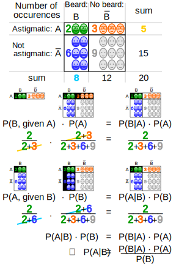
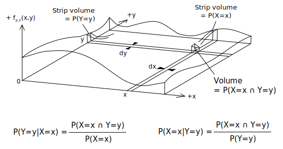
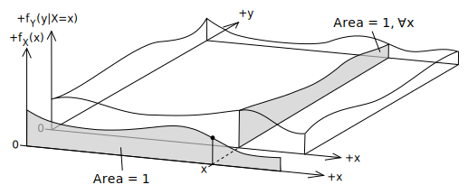
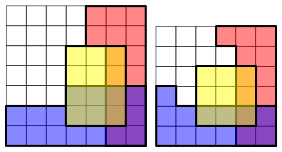

## Średnie


### Twierdzenie Bayes'a

Prawdopodobieństwo (częstość występowania) warunkowe:

$$ {\displaystyle P(A\mid B)={\frac {P(A\cap B)}{P(B)}},{\text{ if }}P(B)\neq 0,} $$
$$ {\displaystyle P(B\mid A)={\frac {P(B\cap A)}{P(A)}},{\text{ if }}P(A)\neq 0,} $$
Prawdopodobieństwo warunkowe dla ciągłych zmiennych losowych X i Y (na podstawie gęstości prawdopodobieństw):

$$ {\displaystyle f_{X\mid Y=y}(x)={\frac {f_{X,Y}(x,y)}{f_{Y}(y)}}} $$

$$ {\displaystyle f_{Y\mid X=x}(y)={\frac {f_{X,Y}(x,y)}{f_{X}(x)}}} $$


Prawdopodobieństwo możemy interpretować jako "częstość zadanych wyników".
**Twierdzenie Bayes'a** mówi, że częstość występowania własności A we własnościach B
jest równe częstości występowania własności B we własnościach A razy częstość występowania własności
A podzielone przez częstość występowania własności B:

$$  P_B(A) P(B) = P_A(B)P(A) $$
$$ P_B(A)={\frac {P_A(B)P(A)}{P_A(B)P(A)+P_{\neg A}(B)P(\neg A)}} $$
Mając własność A i B

* $P(A)$ to częstość występowania cechy A.

* $P(\neg A)$ to częstość występowania bez cechy A, gdzie $1-P(A)=P(\neg A)$.

* $P_{A}(B)$ to częstość występowania cechy B w zbiorze z cechami A (prawdopodobieństwo warunkowe). 

* $P_{\neg A}(B)$ to częstość występowania cechy B w zbiorze bez cech A.

* $P_A(B)$  częstość występowania cechy A w zbiorze z cechami B (prawdopodobieństwo warunkowe).

Twierdzenie Bayes'a w typowej notacji ma postać:
$$ {\displaystyle P(A\mid B)={\frac {P(B\mid A)P(A)}{P(B)}}} $$

Graficznie twierdzenie może być interpretowane w sposób następujący:


{width=50%}


Twierdzenie Bayes'a dla ciągłych zmiennych losowych:

$$ {\displaystyle f_{X\mid Y=y}(x)={\frac {f_{Y\mid X=x}(y)f_{X}(x)}{f_{Y}(y)}}.} $$
Poniżej znajdują się graficzne interpretacje.


{width=50%}


{width=50%}

### Niezależność

Ciekawa uwaga: dwa zdarzenia których suma daje pewność nie mogą być niezależne, 
chyba że same są pewnością albo niemożliwością.

Przykładowo jeśli mam zbiór Ω z ω elementami, 
x elementów ma cechę X, 
y elementów ma cechę Y, 
z elementów ma cechę X i Y,
*nie ma elementów o innych cechach*. 

Jeżeli teraz chcielibyśmy żeby cechy x i y były niezależne 
to ilość x-ów w odniesieniu do y-ów musiała by być równa 
ilości z-ów w odniesieniu do ω, to:


$$ 
\begin{cases}
x + y - z = \omega \\
xy = z\omega
\end{cases}
$$


Rozwiązując powyższy układ dwóch równań wyrugowując najpierw ω a później rozwiązując względem z okazuje się, że jedyne rozwiązania to:

$$ z = x \mid y$$
a ω musi wtedy być:
$$ \omega = x + y - (x \mid y) = x \mid y $$
Czyli X i Y mogą być niezależne tylko wtedy gdy jedno z nich jest Ω.


**Ciekawa uwaga** Istnieją cechy które są niezależne od samych siebie, 
ale są to cechy trywialne (pewność i niemożliwość):

$${\displaystyle \mathrm {P} (A)=\mathrm {P} (A\cap A)=\mathrm {P} (A)\cdot \mathrm {P} (A)\Leftrightarrow \mathrm {P} (A)=0{\text{ or }}\mathrm {P} (A)=1}$$


Jeżeli zbiór Ω ma trzy albo więcej cech, łatwiej już zbudować zbiory niezależne, 
poniżej znajduje się konstrukcja ze strony 
[Wikipedia Conditional Independence](https://en.wikipedia.org/wiki/Conditional_independence):


{width=50%}


### Ciekawostki

<https://en.wikipedia.org/wiki/Conditional_expectation>

<https://en.wikipedia.org/wiki/Copula_(probability_theory)> 
<https://en.wikipedia.org/wiki/Multivariate_normal_distribution>
<https://en.wikipedia.org/wiki/Bayesian_programming>
<https://en.wikipedia.org/wiki/Chow%E2%80%93Liu_tree>
<https://en.wikipedia.org/wiki/Markov_random_field>
<https://en.wikipedia.org/wiki/Disintegration_theorem>


## Punkty linie płaszczyzny objętości - hiper punkty hiper płaszczyzny hiper objętości

### Wiele wymiarów

Jak można zobrazować rzeczy wielowymiarowe, np. kulę 4 wymiarową?

**Nie da się!.**

Ale może tak na prawdę nie jest to takie ważne,
bo na przykład można zobrazować relecje komponentów,
ich dozwolone ruchy w odniesieniu do ruchu innego komponentu.

Dla przykładu kula 4D:

$$ x^2 + y^2 + z^2 + w^2 = 1 $$

Oraz kilka wartości jakie mogą przybierać *x,y,z,w*. 
Zauważmy jak zmienia się ostatnie pudełko jeżeli
dolewamy kolorów do innych.

Wyskokość ostatniego pudełka nie zmienia się w skali 1:1!,
ale widać też pewne tendencje. I powiedzieć tyle o czymś
wielowymiarowym i mieć możliwość przeprowadzania eksperymentów
i obserwacji to już jest coś, to już jest dużo!


```{r plot 4D shpere components, echo=FALSE}
op <- par(
  mfrow = c(2,2),
  mai = c(0.4,0.4,0.1,0.1),
  tck = 0.05
)

labs <- c("x = ","y = ","z = ","w = ")
cols <- rainbow(4)
lims <- c(-1,1)

w1 <- sqrt(1 - 0.5^2 - 0.5^2 - 0.5^2)
s1 <- c(0.5,0.5,0.5,w1)
labs1 <- paste(labs, signif(s1, digits = 3))
barplot(s1, names.arg = labs1, col = cols, ylim = lims)

w2 <- sqrt(1 - 0.5^2 - 0.5^2 - 0.7^2)
s2 <- c(0.5,0.5,0.7,w2)
labs2 <- paste(labs, signif(s2, digits = 3))
barplot(s2, names.arg = labs2, col = cols, ylim = lims)

z3 <- sqrt(1 - 0.5^2 - 0.5^2 - 0.0^2)
s3 <- c(0.5,0.5,z3,0)
labs3 <- paste(labs, signif(s3, digits = 3))
barplot(s3, names.arg = labs3, col = cols, ylim = lims)


w4 <- sqrt((1 - 0.3^2 - 0.3^2 - 0.7^2))
s4 <- c(0.3,0.3,0.7,w4)
labs4 <- paste(labs, signif(s4, digits = 3))
barplot(s4, names.arg = labs4, col = cols, ylim = lims)


# sqrt(sum(s1^2))
# sqrt(sum(s2^2))
# sqrt(sum(s3^2)) ## norm(s3, "F")
# sqrt(sum(s4^2))

grid()
par(op)
```

Ustawiając x = 0.5 i y = 0.5 otrzumujemy okrąg o promieniu sqrt(0.5):
$$ z^2 + w^2 = (\sqrt{0.5})^2 $$
Natomiast dla x = 0.5 i y = 0 otrzumujemy:
$$ z^2 + w^2 = (\sqrt{0.75})^2 $$

Są to rzuty kuli 4D na płaszczyznę 2D.

```{r plot 4D sphere subspaces, echo=FALSE}

upper.half.circle <- function(x=0,y=0,r=1,nsteps=100){  
  rs <- seq(0,pi,len=nsteps) 
  x <- x+r*cos(rs) 
  y <- y+r*sin(rs) 
  list(x=x, y=y)
} 
lower.half.circle <- function(x=0,y=0,r=1,nsteps=100){  
  rs <- seq(0,pi,len=nsteps) 
  x <- x-r*cos(rs) 
  y <- y-r*sin(rs) 
  list(x=x, y=y)
} 


uc1 <- upper.half.circle(x=0.5,y=0.5,r=sqrt(0.5),nsteps=40)
lc1 <- lower.half.circle(x=0.5,y=0.5,r=sqrt(0.5),nsteps=40)
# lc1 <- list(x=uc1$x, y=-uc1$y)

uc2 <- upper.half.circle(x=0.5,y=0,r=sqrt(0.75),nsteps=40)
lc2 <- lower.half.circle(x=0.5,y=0,r=sqrt(0.75),nsteps=40)
# lc2 <- list(x=uc2$x, y=-uc2$y)

plot(x=range(uc1$x,uc2$x), y=range(uc1$y, lc1$y,uc2$y, lc2$y), 
     asp=1, 
     type = "n", xlab = "z", ylab = "w", 
     # xlim = c(-.8,.8), ylim = c(-.7,.7),
     tck = 0.05
     )
lines(uc1)
lines(lc1)
lines(uc2)
lines(lc2)
grid()

# max(uc$y)
```


